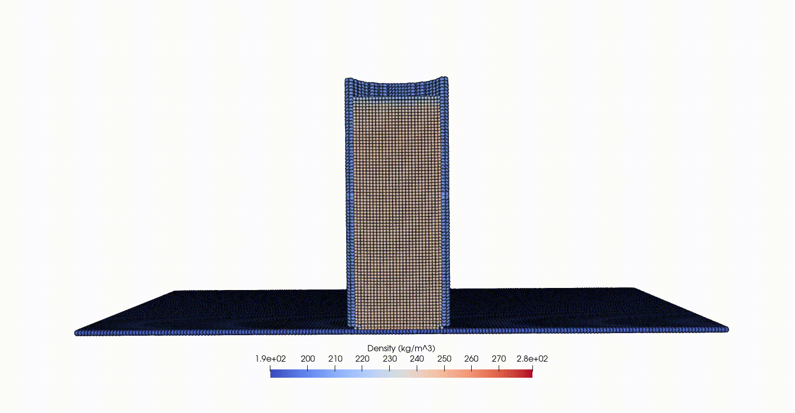

# DualSPHysics-INL
**DualSPHysics-INL** is an extended adaptation of the [DualSPHysics](https://dual.sphysics.org/) open-source Smoothed Particle Hydrodynamics (SPH) simulation software based on DualSPHysics release version 5.0.1. Source code was modified from src_mphase/DSPH_v5.0_NNewtonian. 

**Why DualSPHysics-INL?** While DualSPHysics was developed for the simulation of fluid flow, DualSPHysics-INL was developed to simulate the flow of granular materials, such as soils and biomass feedstocks. In DualSPHysics-INL, a critical state soil mechanics based G-B hypoplastic constitutive model ([Gudehus](https://www.sciencedirect.com/science/article/pii/S0038080620313391) & [Bauer](https://www.sciencedirect.com/science/article/pii/S0038080620313433)) was adopted that has the capability to simulate granular materials of a wide range of mechanical responses. The code adopts a momentum-based boundary condition that is able to sustain impact loading without particles leaking to the outside of the boundaries and can achieve a full range of frictional conditions, including free-slip and no-slip. The code adopts GPU-acceleration, enabling fast computation for complex problems. The following examples provide a glance of applications that the DualSPHysics-INL can simulate!

                          Screw conveyance                                              Cone penetrating in sands

   

                                                Biomass flow in hopper

                            Oedometer compression                               Vane Shearing

   

                               Static Angle of Repose

## Install DualSPHysics-INL
Since the code is based on DualSPHysics, most of the guidances for installation, pre- and post-processing and running from [DualSPHysics Wiki](https://github.com/DualSPHysics/DualSPHysics/wiki) still applies to DualSPHysics-INL. Please follow that Wiki link on how to install DualSPHysics-INL on either Linux, Windows or MacOS systems. Given that the code DualSPHysics-INL was developed and tested in Linux environment, a detailed installation guide using the Linux environment as an example is provided in the following. Remember that ChatGPT or other AI chatbox will be very helpful to answer installation related questions.

### Prerequesite
Not like the original DualSPHysics that supports both CPU and CPU&GPU computation, the current version of DualSPHysics-INL only supports CPU&GPU computation, thus, an Nvidia CUDA-enabled GPU card on a computer or cluster is required to run the code. To check if your computer has an NVIDIA CUDA-enabled GPU, type `lspci | grep -i nvidia`, it will show the NVIDIA GPU model if found.

A C++ compiler (for example gcc) and the CUDA compiler (nvcc) need to be installed. To check if they are installed, type `gcc --version` and `nvcc --version`. Version information will be displayed if they are installed already. The CUDA compiler can be downloaded from the [CUDA Toolkit website](https://developer.nvidia.com/cuda-toolkit).   

### Tested releases:
Linux Ubuntu 20.04 LTS + cuda-10.1 + gcc-9.4.0

Linux Ubuntu 22.04 LTS (TO BE TESTED)

Linux Rocky 8.10 + cuda-12.2 + gcc-12.3.0 (INL Sawtooth cluster)

### Download the LIGGGHTS-INL repository:
Option 1a. For users: `git clone https:xxx.git`

Option 1b. For users: `wget https://github.com/xxx.zip`

Option 2. For developers: `git clone git@github.com:xxx.git`

### Compiling the source code
Navigate to the repository folder DualSPHysics-INL/src-INL/source

`cd DualSPHysics-INL/src-INL/source`

Open Makefile (use such as emacs, nano, vim) and make modifications as needed:

`emacs Makefile`

Inside Makefile, if your gcc version is > 5.0, make sure `USE_GCC5=YES`.

For compiling to the release version, set `USE_DEBUG=NO`, for the debugging version, set it to YES and refer to the “[Developer](link)” section below.

Make sure `COMPILE_CHRONO`, `COMPILE_CHRONO_OMP`, `COMPILE_WAVEGEN` and `COMPILE_MOORDYN` are all set to NO since our current version of DualSPHysics-INL do not have the capability to couple with these functions.

Set the name and directory of the compiled file in `EXECNAME` and `EXECS_DIRECTORY` as desired.

In `"CUDA selection”` section, change `CUDAVER=120` to be compatible with the cuda version installed on your computer and change the corresponding `=== CUDA toolkit directory ===` and `=== Select GPU architectures ===`sections to be compatible with your CUDA version. 

After modifying the Makefile, save it and run (note if it's on cluster, use `module load` to load proper versions of gcc and cuda first):

`make -j<number_of_thread> -f Makefile` (e.g. `make -j4 -f Makefile`)

If the compilation is successful, an executable with the name defined in Makefile `EXECNAME` should appear in the folder defined in `EXECS_DIRECTORY`.

### Quick start - run a test case
Navigate to the folder `DualSPHysics-INL/examples/test_AOR`. Make sure the input file `test_AOR_Def.xml` exist. This is a static angle of repose test case with a small amount of particles that can be computed very fast, but you can also try all other cases in the `/examples/` folder.

Run pre_processing.sh:

`bash pre_processing.sh`

A folder `test_AOR_out` should be generated, within which a file `test_AOR.xml` and a `test_AOR.bi4` should be generated, along with several vtk outputs that can be checked using Paraview or other similar software. 

If the pre-processing generates expected files, go ahead and run the main code:

`bash main_run.sh` (Note, in clusters, this command should be run in the batch mode, e.g. in INL Sawtooth cluster, type `qsub mainRun_sawtoothGPU.pbs`, a template of the 'mainRun_sawtoothGPU.pbs' is attached in the folder but for a specific cluster, follows its user guide. If you start an interactive session instead, make sure you have requested GPU resources and you can run `bash main_run.sh` just like on your local computer).

After the main simulation is completed, a series of data should be generated in a `/test_AOR/data` folder, post-processing the data by:

`bash post_processing.sh`

A series of vtk or txt or csv files will be outputted in the `/test_AOR/particles` folder.

You can also combine the pre-processing, main run and post-processing together by running:

`bash Run.sh`

However, it is always a good practice to run the pre-processing first and check if the initial status generated is correct before running the main simulation.

## DualSPHysics-INL documentation ##

Most of the user guide from [DualSPHysics Wiki](https://github.com/DualSPHysics/DualSPHysics/wiki) still applies to our DualSPHysics-INL solver. Below we only emphasize on changes from the original Wiki documentation. 

### Capabilities ###

•	Granular flow (e.g. soils, biomass materials)

•	Output stresses, density, void ratio, velocity etc. of SPH nodes

•	Able to compute reaction forces and toruqe on boundaries

•	Able to assign free-slip, no-slip and Coulomb friction based frictional boundary conditions.

### Limitations ###

The original DualSPHysics code developed for fluid flow has multiple options such as coupling with other physical engines as described in [DualSPHysics Wiki](https://github.com/DualSPHysics/DualSPHysics/wiki). However, our current version of DualSPHysics-INL for granular flow has not adopted its full range of functions. The limitations are pointed below:
1. The code is only developed for CPU&GPU computing, a cuda GPU-enabled and properly configured computer must be used. Pure CPU compution was not developed.
DualSPHysics-INL does not allow couple with Chrono, MoorDyn+, Discrete Element Modeling (DEM) and wave propagation models.
2. The current code cannot be used for 2D simulations or with any symmetric boundary conditions. 
Only one granular phase is allowed at this point.
3. The floating scheme cannot be enabled. This means that a boundary can be assigned a fixed condition or designated motion and the reaction force from granular particles on the boundary can be computed, however, free motion of boundaries upon interaction with granular particles is not allowed.

### Theory ###

Deteailed explanation of the implemented G-B hypoplastic model and the free-slip/no-slip/frictional boundary conditions please refer to the [publicatoin](#theory). 

### Pre-processing ###

Pre-processing relies on the GenCase binary file located at `/bin/linux/GenCase_linux64` to read a `<casename>_Def.xml` and generate files ready for running in DualSPHysics-INL. The bash file for pre-processing is straightforward. Refer to `pre-processing.sh` in any example on how to modify it. 

[DesignSPHysics](https://www.design.sphysics.org/) provides a convinent way to automatically generate `<casename>_Def.xml`. However, it is based on the original DualSPHysics solver and necessary modification is required on the generated `<casename>_Def.xml` before running DualSPHysics-INL.

### Guide through the input file "_Def.xml" ###

We use the file `/examples/test_AOR/test_AOR_def.xml` as an example to guide how to define the intput file. All the values other than dimensionless parameters are in SI units.  `XML_GUIDE_v5.0.pdf` and `XML_GUIDE_MDBC.pdf` located in `/doc/guides` are user guides from the original DualSPHysics. There are the bases on how to generate the "_Def.xml" file.

***`<constantsdef>`***

`<rhop0>`: bulk density of the granular material.

`<hswl> <gamma> <speedsystem> <coefsound>`: they are used for the original fluid model not for DualSPHysics-INL. Keep them unchanged as they will not be used.

`<speedsound>`: make sure the option `auto` is set to "false" and enter a speed of sound value mannually. Set it to `true` will overwrite the input speed of sound value and calcuate from `<hswl> <gamma> <speedsystem> <coefsound>`, which is not correct.

`coefh`: kernel size $h = coefh* \sqrt{3 dp^2}$ where dp is the initial particle spacing. Keep coefh at a reasonable value is important to mantain accuracy and mitigate numerical instability.

`<h> <b>`: they will not be used. Keep them as they are.

`<massbound> <massfluid>`: keep them to "auto=true" as the mass of individual SPH particles will be computed automatically.

***`<geometry>`***

Follows `XML_GUIDE_v5.0.pdf`. The key is to set the normal direction of boundary particles correctly. This will be covered in the [Defining Normal](#normal) section.

***`<motion>`***

Follows `XML_GUIDE_v5.0.pdf`. 

***constitutive model***

Two constitutive models are implemented in DualSPHysics-INL, G-B hypoplastic model and linear elasticity. They are defined in `<execution><special><hypoplasticity>` and `<execution><special><elasticity>`.

`<hypoplasticity>`:

keep `<phase mkfluid="0">` since only one material phase is allowed.

`<visco>` is the coefficient of artificial viscosity used for mitigating numerical instability. Along with the speed of sounds `<csound>`, the magnitude of numerical instability dissipation is proportional to the multiplicaiton of these two parameters. Note there is also a `<speedsound>` defined in `<casedef><constantsdef>` and a `<Visco>` defined in `<parameters>`, but theese two are used to define time step size.

`<rhop>` is bulk density of the granular material.

The G-B hypoplastic constitutive model ([Gudehus](https://www.sciencedirect.com/science/article/pii/S0038080620313391) & [Bauer](https://www.sciencedirect.com/science/article/pii/S0038080620313433)) is based on critical state soil mechancis. The model has 8 parameters, granulate hardness $h_s$, a constant deciding the pressure-sensitivity of a grain skeleton $n$, critical friction angle $\phi_c$, minimum, critical, and maximum void ratio at zero pressure $e_{d0}$, $e_{c0}$ and $e_{i0}$, a constant that governs the peak shear stress behavior $\alpha$ and a constant relating the incremental stiffness, density and pressure $\beta$. They are also defined in `<hypoplasticity>`.

`<Hypo_initStres_x> <Hypo_initStres_y> <Hypo_initStres_z>` defining the initial stresses in x, y and z directions for all the particle nodes. Ideally they should all be set to zero but since the G-B hypoplastic model is for cohesionless material, assigning a small enough compressional stress value (e.g. -10 Pa) will not alter the result and at the same time prevent tensile stress been generated during explicit time marching. 

`<Hypo_rhoparticle>` is the solid density of the material.

`<Hypo_voidRatio>` initial void ratio of the material, please set it to `Hypo_rhoparticle/rhop - 1` as void ratio, bulk density and solid density are not independent. In the code, void ratio is updated in the main loop and bulk density is computed from this relationship. In the future, we will remove the bulk density as an input parameter to remove the confusion.

`<Hypo_wallfriction>` frictional coefficient. The value will not matter if `<SlipMode>` in `<parameters>` is not set to "5".

`<phasetype>` should be kept as "0".

`<elasticity>` (refer to the example in `/examples/SlidingBlock/SlidingBlock_Def.xml`):

`<lameparm1>` nad `<lameparm2>` are the lame first and second parameters.

Other parameters are similar to what defined in `<hypoplasticity>`. Note that for linear elastic material, the speed of sound can be theoretically determined. Refer to the comment in `<csound>`.

***'<parameters>'***
`<parameter key="Boundary">`: set it to 2. Our boundary is not based on the mDBC method but it runs following the similar code structure. 

`<parameter key="SlipMode">`: choose only from "5" , "6" and "7" for frictional slip, no-slip and free-slip conditions.

`<parameter key="RheologyTreatment">`: choose only value="2". 

`<parameter key="StepAlgorithm">`: choose only value="2".

`<parameter key="VelocityGradientType">`: choose only value="2". 

`<parameter key="Kernel">`: choose only value="2".

`<parameter key="ViscoTreatment">`: choose value="4" for hypoplasticity and "5" for linear elasticity.

`<parameter key="Visco">`: coefficient of viscosity used for determing time step.

`<parameter key="ViscoBoundFactor">`: keep it to "1".

`<parameter key="DensityDT/DensityDTvalue/Shifting/ShiftCoef/ShiftTFS">`: keep all of them to "0" as the current DualSPHysics-INL is not capable of density diffusion or shifting.

`<parameter key="RigidAlgorithm">`: keep it to "1".

`<parameter key="FtPause">`: keep it to "0.0".

`<parameter key="DtAllParticles">`: keep it to "0".

`<parameter key="TimeMax/TimeOut">`: to control the time fo the whole simulation and at what time interval the data are outputted.

***Defining Normal*** <a name="normal">

"to be added"

### Post-processing ###

tobe added

## Citing DualSPHysics-INL ##
Theory of the code / Static Angle of Repose of biomass materials / Oedometer compression of biomass materials:

•	Zhao, Y., Jin, W., Klinger, J., Dayton, D. C., & Dai, S. (2023). [SPH modeling of biomass granular flow: Theoretical implementation and experimental validation](https://www.sciencedirect.com/science/article/abs/pii/S0032591023004096). Powder Technology, 426, 118625.

Other implementation used DualSPHysics-INL:

Biomass flow in hopper and auger:

•	Zhao, Y., Ikbarieh, A., Jin, W., Klinger, J., Saha, N., Dayton, D. C., & Dai, S (2024). [SPH modeling of biomass granular flow: engineering application in hopper and auger](https://pubs.acs.org/doi/10.1021/acssuschemeng.3c08090). ACS Sustainable Chemistry & Engineering. 12(10), 4213-4223.

A fully-connected Artificial Neuron Network (ANN) model for biomass hopper flow:

•	Ikbarieh, A., Jin, W., Zhao, Y., Saha, N., Klinger, J., Xia, Y., & Dai, S (2025). Machine learning assisted cross-scale hopper design for flowing biomass granular materials (ACS Sustainable Chemistry & Engineering, Under Review)

## License ##
(to be added)

## Developers ##
Although we made a substantial amount of modification from the original DualSPHysics-v5.0.1 code, its main structure mostly remained unchanged. Thus, developeres may still refer to the presentation [Developing on DualSPHysics: exampels on code modification and extension](https://dual.sphysics.org/4thusersworkshop/data/_uploaded/Developing%20on%20DualSPHysics.pdf) by O. García-Feal given at the 4th DualSPHysics Users Workshop 2018 on how to add new functionalities to DualSPHysics. 

To compile the code into debugging version, set `USE_DEBUG=YES` in `Makefile` and run `make -f Makefile`. An excutable file named "<*_debug>" will be generated in the same `source` folder.

Pre-processing the testing case and copy the generated files `<casename>.xml` and `<casename>.bi4` to the `source` folder. If stl geometry files are also needed, copy them to the same folder as well.

A CUDA-enabled debugger is needed. `CUDA-GDB` is used as an example below.

Enter the debugging mode by typing `cuda-gdb --args <*_debug> -gpu <casename>`. Documentation on how to use cuda-gdb can be found on its [website](https://docs.nvidia.com/cuda/cuda-gdb/index.html).

